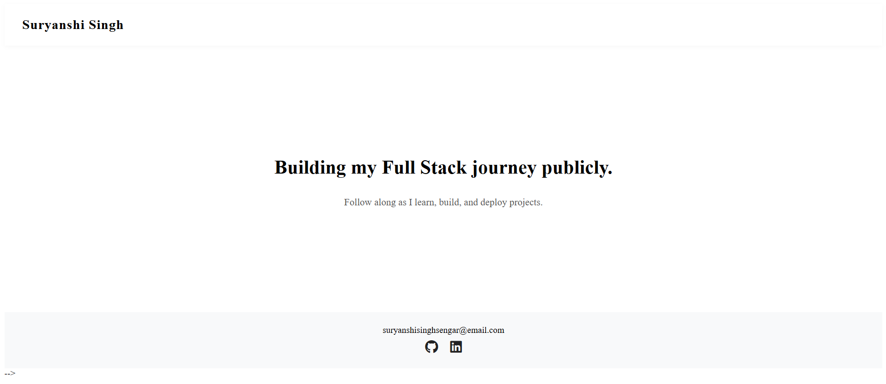

# 🌐 Suryanshi Singh | Personal Landing Page

Welcome to my minimal, responsive personal landing page!  
Showcasing my journey as a Full Stack developer, this site is built with pure HTML, CSS, and a touch of JavaScript for smooth animations.

---

## 🚀 Features

- **Header:**  
  Displays my name as a simple logo, perfectly aligned and spaced.

- **Hero Section:**  
  Tagline and subheading centered with Flexbox.  
  _“Building my Full Stack journey publicly.”_  
  _“Follow along as I learn, build, and deploy projects.”_

- **Footer:**  
  Email contact and social icons (GitHub, LinkedIn) using Font Awesome.  
  Clean background and centered layout.

- **Responsive Design:**  
  Looks great on mobile and desktop.  
  Font sizes and padding adjust for smaller screens.

- **Smooth Fade-In Animation:**  
  Sections gently appear as the page loads, powered by JavaScript and CSS transitions.

---

## 📦 How to Use

1. **Clone or Download**  
   ```
   git clone https://github.com/SURYANSHI-WEB/personal-landing-page.git
   ```

2. **Open in VS Code or your favorite editor**

3. **Run with Live Server**  
   - Right-click `index.html` and select **Open with Live Server**  
   - Or simply open `index.html` in your browser

---

## 🛠️ Tech Stack

- **HTML5**
- **CSS3** (Flexbox, Media Queries, Transitions)
- **JavaScript** (for fade-in animation)
- **Font Awesome** (for social icons)

---

## 💯 Learnings
- Improved Flexbox understanding
- Practiced Git and GitHub workflow
- Building and structuring a landing page from scratch

---

## 👀 Future Improvements
- Add animations and hover effects
- Experiment with React for component-based structuring
- Add multiple sections (About, Projects, Contact) to expand

---

## ✨ Customization

- Change your name/logo in `index.html`
- Update tagline and subheading in the hero section
- Add your email and social profile links in the footer

---

## 📱 Responsive Preview

Test the page on mobile and desktop for a seamless experience!

---

## 🎨 Screenshot


Live link: https://personal-landing-page-pink.vercel.app/

---

## 🤝 Connect

- [GitHub](https://github.com/SURYANSHI-WEB)
- [LinkedIn](https://linkedin.com/in/suryanshi-singh-sengar)
- Email: suryanshisinghsengar@email.com

---

> _“Thanks for visiting my landing page. Follow my journey as I learn, build, and share.
